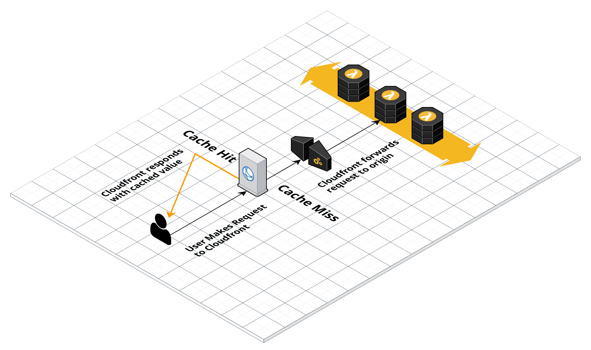

# Dynamic Global Serverless API



Full-stack implementation of a dynamic global serverless API hosted on AWS Lambda.

Check it out at https://headers.owen.dev

# What's in the box?

- Cloudformation code defining:
  - A [Cloudfront Distribution](https://aws.amazon.com/cloudfront/)
  - An [API Gateway](https://aws.amazon.com/api-gateway/)
  - A [Lambda Function](https://aws.amazon.com/lambda/)
- Code for the Lambda Function

## Cloudfront Distribution

Our cloudfront distribution defines one cache behavior:
- It accepts GET and HEAD requests
- Requests are cached based on the values of these headers:
  - _CloudFront-Viewer-City_
  - _CloudFront-Viewer-Country_
  - _CloudFront-Viewer-Country-Name_
  - _CloudFront-Viewer-Country-Region_
  - _CloudFront-Viewer-Country-Region-Name_
  - _CloudFront-Viewer-Latitude_
  - _CloudFront-Viewer-Longitude_
  - _CloudFront-Viewer-Metro-Code_
  - _CloudFront-Viewer-Postal-Code_
  - _CloudFront-Viewer-Time-Zone_
- Responses are cached for up to 1 day.
- All of the above headers are also forwarded to the origin.

```yaml
Distro:
  Type: AWS::CloudFront::Distribution
  Properties:
      ...
      DefaultCacheBehavior:
        AllowedMethods:
          - GET
          - HEAD
        TargetOriginId: 1
        ViewerProtocolPolicy: redirect-to-https
        MinTTL: 0
        MaxTTL: 86400
        DefaultTTL: 86400
        ForwardedValues:
          Headers:
            - CloudFront-Viewer-City
            - CloudFront-Viewer-Country
            - CloudFront-Viewer-Country-Name
            - CloudFront-Viewer-Country-Region
            - CloudFront-Viewer-Country-Region-Name
            - CloudFront-Viewer-Latitude
            - CloudFront-Viewer-Longitude
            - CloudFront-Viewer-Metro-Code
            - CloudFront-Viewer-Postal-Code
            - CloudFront-Viewer-Time-Zone
          QueryString: False
```

We define one Origin that points to our APIGateway resource.

```yaml
Distro:
  Type: AWS::CloudFront::Distribution
  Properties:
      ...
      Origins:
        -
          CustomOriginConfig:
            HTTPSPort: 443
            OriginKeepaliveTimeout: 1
            OriginProtocolPolicy: https-only
            OriginSSLProtocols:
              - TLSv1.2
          DomainName: !Sub
            - '${APIResourceID}.execute-api.${AWS::Region}.amazonaws.com'
            -
              APIResourceID: !GetAtt API.RootResourceId
          Id: 1
          OriginPath: /Prod
      PriceClass: PriceClass_100
```

## Lambda and APIGateway

The Lambda and APIGateway is pretty straightforward. You can find reference material to these Serverless resources [here](https://docs.aws.amazon.com/serverless-application-model/latest/developerguide/sam-specification-resources-and-properties.html).

```yaml
ReturnHeadersFunction:
  Type: AWS::Serverless::Function
  Properties:
      FunctionName: list-headers
      CodeUri: dist/
      Handler: handler.handler
      Runtime: python3.8
      Timeout: 29
      AutoPublishAlias: live
      DeploymentPreference:
          #Change to Canary10Percent5Minutes after developemnt
          Type: AllAtOnce
      MemorySize: 128
      Events:
        APIGateway:
          Type: Api
          Properties:
            Path: /
            Method: GET
            RestApiId: !Ref API
API:
  Type: AWS::Serverless::Api
  Properties:
    Cors: "'headers.owen.dev'"
    StageName: Prod
```

# What to change when forking?

You'll want to update [references](https://github.com/BoraxTheClean/header-api/blob/a5445434c624bc2e39095d2647006fa6d2e91ab6/template.yaml#L29-L46) to `headers.owen.dev` to point to your own domain, or just not use a custom domain at all.

You'll also need to remove references to my [personal site](https://github.com/BoraxTheClean/header-api/blob/a5445434c624bc2e39095d2647006fa6d2e91ab6/src/handler.py#L6-L7) in the Lambda source code.

Update the deployment code to [remove references](https://github.com/BoraxTheClean/header-api/blob/3c1ca12e1eb4fa4e08e92bed0b9d8cfdaf7dee6a/script.sh#L5-L6) to the S3 Bucket in my account.
# Enhancements

This project can be enhanced by:
- Use the new Cloudformation cache support, which does not have cloudformation support at this time.
- Add DNS support for APIGateway, update the deployment code to allow for deploying to each AWS region.

# Where to find me?

[Check out my links here!](https://owen.dev)
